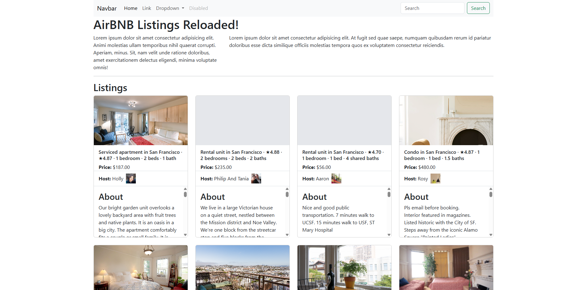

# AirBNB Listings – JavaScript DOM Self Assessment

**Course:** CS5610 Web Development
**Author:** Kaleb Maloof

## Description

This page loads the first 50 San Francisco AirBNB listings from a local JSON file.

Each card shows:

- Thumbnail image
- Listing name and price
- Host name and photo
- About (description), which scrolls within the card
- Amenities, which scroll within the card

Every card is the same size. If an image is missing or fails to load, a blank placeholder is shown instead.

## Screenshot

## Running Locally

`fetch` does not work from `file://`, so serve the folder with a local server, for example VS Code's Live Server extension, then open `index.html`.
